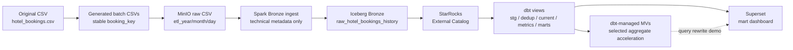

# StarRocks Dataflow

## Mục đích POC

POC này xây dựng một batch BI flow theo kiến trúc lakehouse cho bài toán Hotel Booking Analytics:

```text
Generated batch CSVs
-> MinIO raw CSV
-> Spark Bronze Iceberg append-only raw history
-> StarRocks External Catalog
-> dbt staging / dedup / current / metrics / fact / dim / mart views
-> dbt-managed StarRocks Materialized Views
-> Superset mart dashboard
```

Mục tiêu là validate StarRocks có thể query Iceberg qua External Catalog và serve dashboard layer. Đây không phải performance benchmark chính thức, chưa triển khai realtime, Cube.dev, semantic layer hoặc Agentic AI.

## Kiến trúc



Layer responsibility:

| Layer | Tool | Vai trò |
| --- | --- | --- |
| Source | CSV | File gốc tại `data/input/hotel_bookings.csv`. |
| Batch generation | Python | Tạo incremental batch CSVs và persist `booking_key`. |
| Raw landing | MinIO | Lưu immutable raw CSV theo ingestion partition. |
| Bronze | Spark + Iceberg | Append-only raw history, schema kỹ thuật và ingestion metadata. |
| External access | StarRocks External Catalog | StarRocks query Iceberg table, không sở hữu Iceberg storage. |
| Transform/test | dbt + StarRocks | Dedup, current, metrics, fact/dim/mart views, data tests. |
| Optimization | dbt-managed StarRocks MV | Tạo/refesh một số Materialized Views trong `dbt run`. |
| BI | Superset | Dashboard query mart views only. |

Spark chỉ ingest batch CSV vào Bronze Iceberg. Spark không tính `record_hash`, không dedup, không chọn current record, không tính business metrics.

dbt xử lý:

- `stg_iceberg_raw_hotel_bookings`: normalize fields và compute business-only `record_hash`.
- `int_hotel_bookings_deduped`: exact dedup theo `booking_key + batch_id + record_hash`.
- `int_current_hotel_bookings`: chọn latest record theo `batch_sequence`, `batch_effective_at`, `batch_row_number`.
- `int_booking_metrics`: type casting, cleaning, revenue metrics, lead-time/stay buckets.
- `fact_bookings`, `dim_*`, `mart_*`: dbt views cho Superset.
- `mv_*`: dbt-managed StarRocks Materialized Views.

## Local Resource Constraints

- 16GB RAM preferred.
- 8GB RAM có thể chạy với conservative limits, nhưng StarRocks + Airflow + Superset + Spark có thể nặng.
- Nếu service bị OOM, tăng Docker Desktop memory hoặc tắt bớt service khi không demo.
- dbt threads nên giữ `1` hoặc `2`.

## Dataset Placement

Đặt Kaggle file tại:

```text
data/input/hotel_bookings.csv
```

Batch files sẽ được generate vào:

```text
data/input/incremental_batches/
```

## Start Services

```bash
cp .env.example .env
docker compose config
docker compose up -d --build
```

Open UIs:

| UI | URL | Default login |
| --- | --- | --- |
| MinIO | `http://localhost:9001` | `minioadmin` / `minioadmin` |
| Airflow | `http://localhost:8080` | `admin` / `admin` |
| Superset | `http://localhost:8088` | `admin` / `admin` |
| StarRocks FE | `http://localhost:8030` | if enabled by image |

Stop services:

```bash
docker compose down
```

`docker compose down` giữ named volumes. `docker compose down -v` xóa volumes, gồm MinIO objects, Iceberg warehouse, StarRocks metadata/data, Airflow metadata và Superset metadata.

## Run Pipeline

Manual Airflow trigger:

```bash
docker compose exec airflow-webserver airflow dags unpause hotel_booking_pipeline
docker compose exec airflow-webserver airflow dags trigger hotel_booking_pipeline
```

DAG flow hiện tại:

```text
ingestion
  check_csv_exists
  generate_synthetic_batches
  wait_for_minio
  upload_batches_to_minio
  wait_for_iceberg_rest
  run_spark_iceberg_ingestion
  wait_for_starrocks
  create_starrocks_database
  create_iceberg_external_catalog
  validate_iceberg_history_row_counts

transformation
  dbt_debug
  dbt_run
  dbt_test

validation
  log_validation_counts
```

`dbt run` tạo/refesh Materialized Views vì MV đã được đưa vào dbt model group `materialized_views`.

## Manual dbt Commands

```bash
docker compose exec airflow-webserver dbt debug \
  --project-dir /opt/airflow/dbt/hotel_booking \
  --profiles-dir /opt/airflow/dbt/hotel_booking

docker compose exec airflow-webserver dbt run \
  --project-dir /opt/airflow/dbt/hotel_booking \
  --profiles-dir /opt/airflow/dbt/hotel_booking \
  --no-partial-parse \
  --threads 1

docker compose exec airflow-webserver dbt test \
  --project-dir /opt/airflow/dbt/hotel_booking \
  --profiles-dir /opt/airflow/dbt/hotel_booking \
  --no-partial-parse \
  --threads 1
```

## Validation SQL

```sql
SHOW CATALOGS;
SHOW DATABASES FROM iceberg_catalog;
SHOW TABLES FROM iceberg_catalog.hotel_booking_lakehouse;
SHOW TABLES FROM hotel_booking;
SHOW MATERIALIZED VIEWS FROM hotel_booking;

SELECT batch_id, COUNT(*) AS row_count
FROM iceberg_catalog.hotel_booking_lakehouse.raw_hotel_bookings_history
GROUP BY batch_id
ORDER BY batch_id;

SELECT COUNT(*) FROM hotel_booking.fact_bookings;
SELECT COUNT(*) FROM hotel_booking.mart_channel_performance;
SELECT COUNT(*) FROM hotel_booking.mv_daily_booking_revenue;
```

Run demo checks:

```bash
docker compose exec airflow-webserver python /opt/airflow/scripts/check_connections.py
docker compose exec airflow-webserver python /opt/airflow/scripts/demo_readiness.py
```

## Superset

Connection URI:

```text
starrocks://root:@starrocks:9030/default_catalog.hotel_booking
```

Dashboard should use mart objects only:

- `mart_daily_booking_revenue`
- `mart_monthly_booking_revenue`
- `mart_hotel_performance`
- `mart_room_performance`
- `mart_market_segment_performance`
- `mart_channel_performance`
- `mart_country_performance`
- `mart_cancellation_analysis`
- `mart_lead_time_analysis`
- `mart_customer_type_performance`

Do not build charts from raw/staging/intermediate/fact/dim objects.

## Known Limitations

- Batch-only MVP.
- Synthetic `booking_key` is for demo only; production should use source booking/reservation ID.
- Bronze Iceberg stores raw history, not business-ready curated tables.
- dbt models are mostly views, so query performance depends on StarRocks + Iceberg access unless MV rewrite applies.
- Materialized Views cover only selected aggregate queries for demo.
- dbt-managed MVs are asynchronous StarRocks Materialized Views over dbt views; this requires a StarRocks version that supports MVs over existing views.
- Superset dashboard metadata may be reset if Superset volume is removed.

## Troubleshooting

If Iceberg append fails after switching from the older Silver/Spark version, first retry the DAG. Spark ingestion now tries to drop legacy Bronze columns such as `record_hash` and `watermark_date`.

If Iceberg metadata is already inconsistent from previous local experiments, reset local volumes:

```bash
docker compose down -v
docker compose up -d --build
```

This deletes MinIO objects, Iceberg warehouse files, StarRocks data, Airflow metadata and Superset metadata.
