# StarRocks Dataflow - Trịnh Đức An (S.AI.20K)

## Mục tiêu POC

POC này validate một **local batch BI dataflow** cho bài toán **Hotel Booking Analytics**. Mục tiêu chính là kiểm tra cách StarRocks có thể đóng vai trò:

- query dữ liệu từ lakehouse layer thông qua **External Catalog**
- materialize **Gold fact/dim/mart tables** vào StarRocks internal storage
- serve mart tables cho **Superset dashboard**
- tối ưu một số dashboard query lặp lại bằng **Materialized View + Query Rewrite**

POC này tập trung vào **functional feasibility** và **architecture design**, không phải performance benchmark chính thức.

## 1. Layer & Storage Design

```mermaid
flowchart LR
    A["Hotel Booking CSV"] --> B["Synthetic Batch Generator"]
    B --> C["MinIO raw bucket<br/>partitioned by etl_date / watermark"]
    C --> D["Spark Bronze ingestion"]
    D --> E["Bronze Iceberg<br/>raw_hotel_bookings_history<br/>append-only raw history"]
    E --> F["Spark Silver build"]
    F --> G["Silver Iceberg<br/>dedup / SCD2 versions / current / metrics"]
    G --> H["StarRocks External Catalog<br/>iceberg_catalog"]
    H --> I["dbt Views<br/>over Iceberg Bronze/Silver"]
    I --> J["StarRocks Internal Gold<br/>fact / dim / mart"]
    J --> K["StarRocks Materialized Views<br/>query rewrite"]
    J --> L["Superset Dashboard<br/>mart tables only"]
    K -. "query rewrite optimization" .-> L
```



| Layer | Tool / Format | Storage / Object | Responsibility |
| --- | --- | --- | --- |
| Source | CSV | `data/input/hotel_bookings.csv` | Original Kaggle dataset. |
| Synthetic batch layer | Python-generated CSV | `data/input/incremental_batches/batch_*.csv` | Generate deterministic incremental batches with persisted `booking_key`, updates, duplicate replay and SCD2 fixtures. |
| Raw landing | MinIO / CSV | `hotel-booking-raw/.../etl_year=.../watermark_date=.../raw_batch_sequence=.../batch_*.csv` | Immutable raw batch files for replay, audit and debug. |
| Bronze lakehouse | Iceberg / Parquet on MinIO | `iceberg_catalog.hotel_booking_lakehouse.raw_hotel_bookings_history` | Append-only raw historical records, partitioned by `watermark_date`. |
| Silver lakehouse | Iceberg / Parquet on MinIO | `iceberg_catalog.hotel_booking_silver.*` | Physical dedup, SCD2/version history, current state and metrics tables built by Spark. |
| External catalog | StarRocks External Catalog | `iceberg_catalog` | StarRocks reads Iceberg tables without owning their storage or table type. |
| dbt staging/intermediate | dbt + StarRocks views | `stg_*`, `int_*` | Expose Bronze/Silver Iceberg objects as StarRocks views and run validation tests. |
| Gold serving | StarRocks internal tables | `fact_bookings`, `dim_*`, `mart_*` | Materialized dbt serving layer for BI. |
| Optimization | StarRocks Materialized Views | `mv_daily_booking_revenue`, `mv_monthly_booking_revenue`, `mv_hotel_performance` | Precompute selected aggregations and validate query rewrite. |
| Dashboard | Superset | Datasets from `mart_*` tables | BI visualization from StarRocks mart tables. |

## 2. Dataset

Dataset sử dụng: **Hotel Booking Demand**

- Rows: `119,390`
- Columns: `32`
- Grain: `1 row = 1 hotel booking record`
- Domain fit: hospitality / hotel / resort BI

Dataset có các chiều phân tích phù hợp với dashboard:

- `hotel`
- `arrival_date`
- `room type`
- `market_segment`
- `distribution_channel`
- `country`
- `customer_type`
- `lead_time`
- `is_canceled`
- `adr`

Dataset không có real cost/expense, nên đây **không phải true PNL dataset**. Các metrics như `estimated_revenue` và `realized_revenue` được derive từ `adr * total_nights`.

## 3. Raw MinIO Storage

Raw batch files được lưu immutable trên MinIO theo Hive-style ingestion partition.

Ví dụ path:

```text
hotel-booking-raw/
  hotel_booking_demand/
    incremental_batches/
      etl_year=2026/
        etl_month=01/
          etl_day=01/
            watermark_date=20260101/
              raw_batch_sequence=001/
                batch_001_initial.csv
```

Lý do dùng partition path:

- dễ audit batch nào được ingest vào ngày nào
- dễ replay/debug từng batch
- dễ cleanup/retention theo `etl_date` hoặc `watermark_date`
- tránh lưu raw files trong một flat folder khó quản lý

Current generated batch files:

| Batch file | Purpose | Expected row count |
| --- | --- | ---: |
| `batch_001_initial.csv` | Initial business state | 119,390 |
| `batch_002_updates.csv` | Selected changed records, exact duplicates and new records | 17 |
| `batch_003_duplicate_replay.csv` | Replay duplicates to test idempotency | 15 |
| `batch_004_same_state.csv` | `A -> A -> A` fixture, expected 1 SCD2 version | 1 |
| `batch_005_reverted_state.csv` | `A -> B -> A` fixture, expected 3 SCD2 versions | 1 |

## 4. Iceberg Storage

Iceberg stores table metadata and physical Parquet files in the MinIO `warehouse` bucket.

Điểm quan trọng:

- MinIO raw bucket chỉ lưu immutable CSV batch files.
- Iceberg quản lý table metadata, snapshots, manifests và physical Parquet files.
- Không nên debug Iceberg bằng cách đọc trực tiếp folder Parquet.
- Nên inspect lineage qua SQL columns như `source_object_path`, `file_hash`, `watermark_date`, `batch_id`, `batch_sequence`.

### 4.1 Bronze Iceberg

| Table | Purpose | Partition |
| --- | --- | --- |
| `iceberg_catalog.hotel_booking_lakehouse.raw_hotel_bookings_history` | Append-only raw historical records with ingestion metadata and business-only `record_hash` | `watermark_date` |

Bronze table giữ toàn bộ raw history theo batch. Đây là nơi phục vụ replay, audit và kiểm tra incremental load.

### 4.2 Silver Iceberg

| Table | Purpose |
| --- | --- |
| `deduped_hotel_bookings` | Exact duplicate collapse by `booking_key + batch_id + record_hash` |
| `hotel_booking_versions` | SCD Type 2 / version history from change records only |
| `current_hotel_bookings` | Latest `is_current = 1` version per `booking_key` |
| `booking_metrics` | Typed, cleaned metrics table with derived fields for Gold dbt models |

Silver tables là physical Iceberg tables được build bởi Spark. Việc để Silver ở Iceberg giúp phát huy ưu điểm của lakehouse: lưu intermediate/checkpoint data ngoài StarRocks internal storage, giảm áp lực SSD/storage cho StarRocks, đồng thời giữ khả năng audit/replay.

## 5. Incremental, Dedup & SCD2 Logic

### 5.1 Stable Key

```text
booking_key = source_dataset + ':' + original_source_row_number
```

`booking_key` được generate một lần bởi `scripts/generate_synthetic_batches.py` và được persist trong mọi generated batch file.

Spark **không được regenerate** key này bằng non-deterministic `row_number()`, vì như vậy các batch sau có thể không match đúng business entity.

### 5.2 Hash Rule

`record_hash` được compute từ normalized business columns only.

Excluded from `record_hash`:

- `batch_id`
- `batch_sequence`
- `source_file_name`
- `source_object_path`
- `file_hash`
- `ingested_at`
- `row_ingestion_id`
- `synthetic_operation`
- derived metrics như `estimated_revenue`, `realized_revenue`, `cancellation_rate`

Lý do: `record_hash` phải đại diện cho **business state**, không phải ingestion metadata. Nếu metadata được đưa vào hash, cùng một business record ingest lại ở batch khác sẽ bị hiểu nhầm là business change.

### 5.3 Exact Dedup

Silver exact dedup loại duplicate/replay records theo key:

```text
booking_key + batch_id + record_hash
```

Logic này chỉ remove duplicate trong cùng batch, không global dedup theo `booking_key + record_hash`, vì case `A -> B -> A` vẫn phải được giữ lại để tạo đúng 3 SCD2 versions.

### 5.4 SCD2 / Version History

SCD2 là **versioning/storage technique**, không phải một business layer riêng trong dbt.

Trong POC này:

- Spark Silver build physical version table: `iceberg_catalog.hotel_booking_silver.hotel_booking_versions`
- dbt expose table này thành StarRocks view: `hotel_booking.int_hotel_booking_versions`
- view này dùng cho dbt tests và downstream Gold models

SCD2 logic:

- order records by `booking_key`, `batch_sequence`, `batch_effective_at`
- detect change bằng `LAG(record_hash)`
- consecutive same `record_hash` values được compress thành một version
- `valid_from = batch_effective_at`
- `valid_to = LEAD(valid_from)` over change records
- `is_current = valid_to IS NULL`

Expected behavior:

| Case | Expected behavior |
| --- | --- |
| `A -> A -> A` | 1 version |
| `A -> B -> A` | 3 versions |
| Duplicate replay | Không làm tăng current/fact/mart counts |
| Same `booking_key + batch_id` nhưng nhiều `record_hash` | Validation fails |

## 6. dbt Models

dbt chạy qua StarRocks. dbt không đọc trực tiếp file trong MinIO.

Actual flow:

```text
MinIO raw CSV
-> Bronze Iceberg
-> Silver Iceberg
-> StarRocks External Catalog
-> dbt views over Iceberg
-> StarRocks internal Gold fact/dim/mart tables
```

| dbt object | Type | Source | Purpose |
| --- | --- | --- | --- |
| `stg_iceberg_raw_hotel_bookings` | View | Bronze Iceberg raw history | Expose raw history with typed metadata |
| `int_hotel_bookings_deduped` | View | Silver `deduped_hotel_bookings` | Expose deduped records |
| `int_hotel_booking_versions` | View | Silver `hotel_booking_versions` | Expose version history/SCD2 result |
| `int_current_hotel_bookings` | View | Silver `current_hotel_bookings` | Expose current state |
| `int_booking_metrics` | View | Silver `booking_metrics` | Expose cleaned metrics for Gold models |
| `fact_bookings` | Internal table | `int_booking_metrics` | Booking-level Gold fact, stable by `booking_key` |
| `dim_*` | Internal tables | `int_booking_metrics` | Analysis dimensions |
| `mart_*` | Internal tables | `fact_bookings` / `dim_*` | Superset-ready aggregated marts |

## 7. StarRocks Table Type Strategy

StarRocks table type ảnh hưởng tới cách data được lưu, merge, replace hoặc aggregate trong StarRocks internal storage.

| Object | Storage owner | StarRocks type | Reason |
| --- | --- | --- | --- |
| Bronze/Silver Iceberg tables | Iceberg | Not applicable | External tables are managed by Iceberg, not StarRocks internal storage |
| `stg_*`, `int_*` | StarRocks view definitions over Iceberg | View | Keep stg/int lightweight and avoid duplicating Silver storage into StarRocks SSD |
| `fact_bookings` | StarRocks internal | `PRIMARY KEY(booking_key)` | Stable one row per current booking, used as serving fact and MV source |
| `dim_*` | StarRocks internal | `DUPLICATE KEY` in current MVP | Small full-refresh dimension tables generated from `SELECT DISTINCT`; uniqueness is controlled by dbt SQL/tests |
| `mart_*` | StarRocks internal | `DUPLICATE KEY` | Aggregated serving tables rebuilt by dbt full-refresh in local MVP |
| `mv_*` | StarRocks internal MV | Materialized View | Precompute selected aggregations and validate query rewrite |

Note về `dim_*`:

- Current MVP dùng `DUPLICATE KEY` cho `dim_*` vì dimension tables nhỏ, được full-refresh và uniqueness do dbt kiểm soát.
- Nếu production hoặc muốn semantic chặt hơn, stable current dimensions nên dùng `PRIMARY KEY(dimension_key)`.
- Historical/SCD dimensions nên dùng grain kiểu `natural_key + valid_from`.

## 8. Airflow Pipeline

Airflow orchestrates batch pipeline theo 5 nhóm chính:

```text
precheck
-> ingestion
-> transformation
-> optimization
-> validation
```

Detailed flow:

```text
precheck:
  check_csv_exists
  profile_dataset
  generate_synthetic_batches

ingestion:
  wait_for_minio
  upload_batches_to_minio
  wait_for_iceberg_rest
  run_spark_iceberg_ingestion
  wait_for_starrocks
  create_starrocks_database
  create_iceberg_external_catalog
  validate_iceberg_history_row_counts
  run_spark_iceberg_silver_models
  validate_iceberg_silver_tables

transformation:
  dbt_debug
  dbt_run
  dbt_test

optimization:
  apply_starrocks_materialized_views
  validate_materialized_view_rewrite

validation:
  log_validation_counts
```

Superset không nằm trong Airflow DAG vì Superset là BI serving/consumer layer. DAG chỉ build và validate data layer. Sau khi DAG chạy xong, Superset query mart tables để render dashboard.

## 9. Validation

| Validation area | Implementation |
| --- | --- |
| Dataset exists | Airflow `check_csv_exists`, local file check |
| Raw MinIO objects | `scripts/demo_readiness.py` checks 5 partitioned raw batch objects |
| Bronze row count | Airflow compares generated CSV row count with Iceberg raw history count by `batch_id` |
| Silver tables | Airflow checks Silver Iceberg tables are visible from StarRocks and non-empty |
| Multiple states per batch | dbt custom tests fail if one `booking_key + batch_id` has multiple distinct `record_hash` |
| Duplicate current version | dbt custom test checks only one current version per `booking_key` |
| SCD2 overlap | dbt custom test checks no overlapping validity periods |
| Fixture behavior | dbt tests validate `A -> A -> A = 1 version` and `A -> B -> A = 3 versions` |
| dbt result | Current validation: `dbt run` passed `24/24`, `dbt test` passed `86/86` |
| MV validation | Checks MV exists, active, `query_rewrite_status = VALID`, totals match marts, and `EXPLAIN` uses `mv_daily_booking_revenue` |

Current row count snapshot:

| Object | Row count |
| --- | ---: |
| Bronze raw history | 119,424 |
| Silver `deduped_hotel_bookings` | 119,422 |
| Silver `hotel_booking_versions` | 119,405 |
| Silver `current_hotel_bookings` | 119,395 |
| Silver `booking_metrics` | 119,395 |
| Gold `fact_bookings` | 119,395 |
| `mart_daily_booking_revenue` | 793 |
| `mart_monthly_booking_revenue` | 26 |
| `mart_hotel_performance` | 2 |

Lưu ý: row count snapshot là kết quả của generated batches hiện tại. Nếu batch generator thay đổi, số liệu validation cần được cập nhật lại.

## 10. Materialized View

Materialized Views là optimization layer trong StarRocks. MVs được tạo/refreshed sau khi `dbt_test` pass.

| MV | Source | Validation |
| --- | --- | --- |
| `mv_daily_booking_revenue` | `fact_bookings` | Totals match `mart_daily_booking_revenue`; `EXPLAIN` rewrite validated |
| `mv_monthly_booking_revenue` | `fact_bookings` | Totals match `mart_monthly_booking_revenue` |
| `mv_hotel_performance` | `fact_bookings` | Totals match `mart_hotel_performance` |

Important distinction:

```text
dbt mart tables = business source of truth for dashboard
Materialized Views = StarRocks optimization layer
Superset = query mart datasets by default
StarRocks may rewrite matching queries to MV internally
```

## 11. Dashboard

Superset dashboard dùng **StarRocks mart tables only**.

Allowed datasets:

- `mart_daily_booking_revenue`
- `mart_monthly_booking_revenue`
- `mart_hotel_performance`
- `mart_room_performance`
- `mart_market_segment_performance`
- `mart_channel_performance`
- `mart_country_performance`
- `mart_cancellation_analysis`
- `mart_lead_time_analysis`
- `mart_customer_type_performance`

Do not use:

- raw tables
- staging/intermediate views
- SCD2/version history tables
- fact table
- dimension tables

Lý do: mart tables đã được aggregate theo use case dashboard. Nếu dashboard query raw/staging/intermediate/fact trực tiếp, business logic sẽ bị phân tán vào BI layer và dễ gây double count.

## 12. Scope & Limitations

Included:

- batch-only pipeline
- MinIO raw landing
- Bronze/Silver Iceberg on MinIO
- StarRocks External Catalog
- dbt views and Gold internal tables
- StarRocks Materialized View + Query Rewrite validation
- Superset dashboard from mart tables

Not included:

- realtime / streaming
- Cube.dev
- semantic layer
- Agentic AI
- formal performance benchmark
- real PNL, real cost, real profit calculation

## 13. Final Takeaway

So với MVP ban đầu chỉ load CSV vào StarRocks, flow hiện tại production-like hơn:

- raw batch files được lưu immutable trên MinIO
- Iceberg quản lý Bronze/Silver historical and intermediate tables
- Spark xử lý ingestion, dedup, SCD2/versioning, current state và metrics ở lakehouse layer
- StarRocks đọc Iceberg qua External Catalog
- dbt expose Silver bằng views và materialize Gold fact/dim/mart internal tables
- Superset chỉ đọc mart tables
- StarRocks MV validate khả năng query rewrite và serving optimization

Trade-off là local setup phức tạp hơn vì có thêm MinIO, Spark, Iceberg REST Catalog, StarRocks, dbt, Airflow và Superset. Tuy nhiên flow này thể hiện rõ hơn vai trò của Iceberg cho lakehouse storage và StarRocks cho serving/optimization layer.
