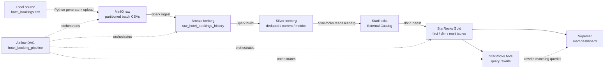

# Architecture

Tài liệu này mô tả architecture của local BI POC. Mục tiêu là giữ tinh thần của production-like flow, nhưng triển khai đơn giản hơn để chạy được trên laptop.

## Original Idea

Architecture gốc trong dự án production-like có thể dùng:

```text
Source / VPL System
  -> Ingestion Layer
  -> Raw S3
  -> Redshift transformation
  -> Curated CDP / finance mart / pre-aggregation
  -> Redshift / ClickHouse serving
  -> Cube.dev semantic layer
  -> BI Portal / Dashboard / ML / Agentic BI
```

POC này không rebuild full architecture đó.

## Local POC Architecture

Architecture local MVP:



## Scope

This MVP is batch-only.

Included:

- Local CSV ingestion.
- Raw object storage in MinIO.
- Append-only Bronze Iceberg raw history.
- Silver Iceberg tables for deduped data, current state, and booking metrics.
- StarRocks external catalog for Iceberg.
- dbt staging/intermediate views over Iceberg Silver tables.
- Internal StarRocks Gold fact/dim/mart serving tables.
- dbt tests and Gold transformations through StarRocks.
- StarRocks Materialized Views for selected aggregate/query rewrite validation.
- Airflow manual DAG orchestration.
- Superset dashboard from mart tables.

Not included:

- Realtime/streaming.
- Cube.dev.
- Semantic layer.
- Agentic AI.
- Formal performance benchmark.
- Real PNL, real cost, or real profit calculation.

## Layer Responsibilities

| Layer | Tool | Responsibility |
| --- | --- | --- |
| Source CSV | `data/input/hotel_bookings.csv` | Local Kaggle dataset used as hospitality BI sample data. |
| Synthetic batches | Python | Generates deterministic incremental batch CSVs with persisted `booking_key`. |
| Raw storage | MinIO | Stores immutable raw batch CSVs under Hive-style ingestion partitions such as `hotel_booking_demand/incremental_batches/etl_year=2026/etl_month=01/etl_day=01/raw_batch_sequence=001/`. |
| Bronze ingestion | Spark / PySpark | Enforces raw schema, enriches ingestion metadata, computes business-only `record_hash`, and appends to Iceberg. |
| Bronze lakehouse history | Iceberg | Stores append-only raw history partitioned by `watermark_date`. Physical data format is Parquet managed by Iceberg. |
| Silver build | Spark / PySpark | Builds deterministic Iceberg tables for exact dedup, current state, and booking metrics. Technical change history stays internal to this layer. |
| Silver lakehouse tables | Iceberg | Stores physical Silver tables under `iceberg_catalog.hotel_booking_silver`. |
| External catalog | StarRocks | Queries Bronze/Silver Iceberg tables through `iceberg_catalog`; StarRocks does not own these external table types. |
| Transformation | dbt + StarRocks | Exposes staging/intermediate views over Bronze/Silver Iceberg tables, runs tests, and materializes Gold fact/dim/mart tables. |
| Warehouse / serving | StarRocks | Stores internal Gold fact/dim/mart serving tables and serves Superset queries from mart tables. |
| Optimization | StarRocks Materialized View | Precomputes selected aggregations and validates query rewrite after dbt tests pass. |
| Orchestration | Airflow | Runs the batch pipeline manually: profile, generate, upload, Spark ingest, dbt run/test, MV optimization, mart validation. |
| Dashboard | Superset | Creates datasets and charts from StarRocks mart tables. |

## Important dbt Note

dbt does not transform files directly in MinIO.

Actual flow:

```text
CSV -> MinIO raw batch CSVs -> Bronze Iceberg raw history -> Silver Iceberg tables -> StarRocks external catalog -> dbt views/Gold tables in StarRocks -> StarRocks mart tables
```

MinIO is the raw object storage layer. Iceberg stores historical raw batches and physical Silver tables. StarRocks reads Iceberg through external catalog. dbt keeps staging/intermediate objects as StarRocks views over Iceberg and materializes only Gold fact/dim/mart serving objects as internal StarRocks tables.

## Dedup, Current-State, And Incremental Logic

- `booking_key = source_dataset + original_source_row_number` is generated once by the batch generator and persisted in every generated batch.
- Raw batch files are stored in MinIO using ingestion partition folders: `etl_year`, `etl_month`, `etl_day`, and `raw_batch_sequence`.
- These raw partition fields are for storage organization and replay/debug. They do not replace `booking_key`, `batch_id`, `batch_sequence`, or `batch_effective_at`.
- Bronze Iceberg `raw_hotel_bookings_history` is partitioned by `watermark_date` to match daily batch access and pruning.
- Iceberg warehouse file layout is managed by Iceberg metadata; lineage should be inspected through SQL columns such as `source_object_path`, `file_hash`, and `watermark_date`, not by manually reading Parquet folder paths.
- Spark computes `record_hash` from normalized business columns only. Ingestion metadata and derived metrics are excluded from the hash.
- Spark Silver build exact dedup collapses duplicate rows by `booking_key + batch_id + record_hash`.
- Spark Silver build derives current state by ordering records by `booking_key`, `batch_sequence`, and `batch_effective_at`.
- Consecutive same `record_hash` values are skipped before current-state selection.
- The current Silver table keeps only the latest changed business state per `booking_key`.
- dbt exposes the Silver tables as views and validates constraints such as one current row per `booking_key`, no multiple business states per batch, and fixture behavior.
- There is no separate business layer/table/model for change tracking/history in this MVP. Change detection is embedded in the Spark Silver current-state build.

## StarRocks Table Type Note

| Layer / model | Storage owner | StarRocks table type |
| --- | --- | --- |
| Bronze `iceberg_catalog.hotel_booking_lakehouse.raw_hotel_bookings_history` | Iceberg external table | Not applicable |
| Silver `iceberg_catalog.hotel_booking_silver.deduped_hotel_bookings` | Iceberg external table | Not applicable |
| Silver `iceberg_catalog.hotel_booking_silver.current_hotel_bookings` | Iceberg external table | Not applicable |
| Silver `iceberg_catalog.hotel_booking_silver.booking_metrics` | Iceberg external table | Not applicable |
| `stg_iceberg_raw_hotel_bookings` | StarRocks view over Bronze Iceberg raw history | View, no table type |
| `int_hotel_bookings_deduped` | StarRocks view over Silver Iceberg table | View, no StarRocks table type |
| `int_current_hotel_bookings` current model | StarRocks view over Silver current table | View, no StarRocks table type |
| `int_booking_metrics` | StarRocks view over Silver metrics table | View, no StarRocks table type |
| `fact_bookings` | StarRocks internal Gold dbt table | `PRIMARY KEY(booking_key)` |
| `dim_*` tables | StarRocks internal Gold dbt tables | `PRIMARY KEY` where configured |
| `mart_*` tables | StarRocks internal Gold dbt tables | `DUPLICATE KEY` for MVP |
| `mv_*` materialized views | StarRocks internal MV layer | `REFRESH MANUAL` aggregate acceleration/query rewrite |

## Materialized Views

Materialized Views are part of the main Airflow pipeline optimization step. They are created and refreshed after `dbt_test` succeeds.

Current MVs:

- `mv_daily_booking_revenue`
- `mv_monthly_booking_revenue`
- `mv_hotel_performance`

They are created from `hotel_booking.fact_bookings`, refreshed with `REFRESH MANUAL ... WITH SYNC MODE`, and validated against the equivalent dbt mart totals. The DAG also validates query rewrite by checking that a matching aggregate query on `fact_bookings` scans `mv_daily_booking_revenue` in the `EXPLAIN` plan.

Superset still defaults to dbt mart datasets. The MV layer demonstrates StarRocks serving optimization; dbt mart tables remain the business source of truth.

## StarRocks Role in This POC

In the original production-like flow, Redshift and ClickHouse may split warehouse/transformation and serving responsibilities.

In this local MVP, StarRocks replaces both roles:

- warehouse table storage
- transformation target for Gold dbt models
- serving source for Superset dashboard

This is a functional local validation, not a formal benchmark.
