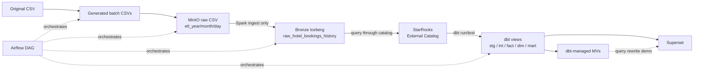

# Architecture

Tài liệu này mô tả kiến trúc hiện tại của local BI POC sau lakehouse refactor.

## Original Idea

Production-like flow ban đầu có thể dùng Redshift/ClickHouse cho warehouse/serving và có semantic layer như Cube.dev. POC này không rebuild full architecture đó.

## Local MVP Flow

```text
Generated batch CSVs
-> MinIO raw CSV
-> Spark Bronze Iceberg append-only raw history
-> StarRocks External Catalog
-> dbt staging/dedup/current/metrics/fact/dim/mart views
-> dbt-managed StarRocks Materialized Views
-> Superset mart dashboard
```



## Scope

Included:

- deterministic incremental batch CSV generation
- raw CSV landing in MinIO
- append-only Bronze Iceberg table
- StarRocks External Catalog over Iceberg
- dbt transformations and tests through StarRocks
- fact/dim/mart views for dashboard
- dbt-managed StarRocks Materialized Views
- Superset dashboard from mart views

Not included:

- realtime/streaming
- Cube.dev
- semantic layer
- Agentic AI
- formal benchmark
- real PNL/cost/profit

## Layer Responsibilities

| Layer | Tool | Responsibility |
| --- | --- | --- |
| Source | CSV | Original Hotel Booking Demand dataset. |
| Batch generation | Python | Creates deterministic batches with persisted `booking_key`. |
| Raw landing | MinIO | Stores immutable CSV files under `etl_year/etl_month/etl_day/raw_batch_sequence`. |
| Bronze ingestion | Spark | Reads raw CSV batches and appends source columns plus lightweight metadata to Iceberg. |
| Bronze storage | Iceberg | Stores append-only raw history as Parquet with table metadata/snapshots. |
| External catalog | StarRocks | Lets StarRocks query Iceberg tables without owning external storage. |
| Transformation | dbt | Computes `record_hash`, dedup, current, metrics, fact/dim/mart views and tests. |
| Optimization | dbt + StarRocks MV | Creates selected physical aggregate MVs during `dbt run`. |
| Dashboard | Superset | Queries mart views only. |
| Orchestration | Airflow | Runs the manual batch flow sequentially. |

## Important Logic

- Spark does not do business transformation.
- `record_hash` is computed in `stg_iceberg_raw_hotel_bookings` from normalized business columns only.
- Exact dedup happens in `int_hotel_bookings_deduped` using `booking_key + batch_id + record_hash`.
- Current record happens in `int_current_hotel_bookings` using latest `batch_sequence`, `batch_effective_at`, `batch_row_number`.
- Metrics are derived in `int_booking_metrics`.
- `fact_bookings`, `dim_*`, and `mart_*` are dbt views.
- `mv_daily_booking_revenue`, `mv_monthly_booking_revenue`, and `mv_hotel_performance` are physical StarRocks Materialized Views managed by dbt.

## StarRocks Table Type Strategy

| Object | Storage owner | StarRocks type |
| --- | --- | --- |
| `iceberg_catalog.hotel_booking_lakehouse.raw_hotel_bookings_history` | Iceberg | Not applicable |
| `stg_*`, `int_*`, `fact_bookings`, `dim_*`, `mart_*` | StarRocks view definitions | View |
| `mv_*` | StarRocks | Asynchronous Materialized View |

Iceberg external tables do not use StarRocks table types. StarRocks table types apply only to StarRocks-owned internal physical objects. In this refactor, only the selected MVs are physical StarRocks optimization objects.

Note: dbt-managed MVs are built over dbt views. This requires a StarRocks version that supports asynchronous Materialized Views over existing views.
