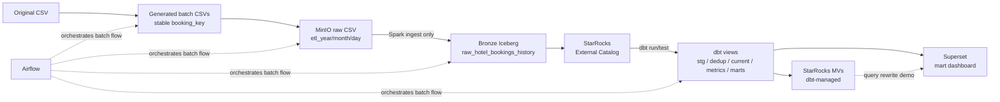

# StarRocks Dataflow POC - Mentor Report

## 1. Mục đích

POC kiểm chứng một batch BI flow theo kiến trúc lakehouse cho hospitality booking analytics:

```text
Generated batch CSVs
-> MinIO raw CSV
-> Spark Bronze Iceberg raw history
-> StarRocks External Catalog
-> dbt views and tests
-> dbt-managed StarRocks Materialized Views
-> Superset mart dashboard
```

Mục tiêu là show StarRocks query Iceberg qua External Catalog và serve dashboard local MVP. Đây không phải performance benchmark, chưa có realtime, Cube.dev, semantic layer hoặc Agentic AI.

## 2. Architecture Diagram



## 3. Layer Logic

| Layer | Storage/Engine | Logic |
| --- | --- | --- |
| Source | Local CSV | Kaggle Hotel Booking Demand. |
| Batch generation | Python | Generate deterministic incremental batches and persisted `booking_key`. |
| Raw landing | MinIO CSV | Store immutable raw files under `etl_year/etl_month/etl_day/raw_batch_sequence`. |
| Bronze | Spark + Iceberg | Append raw source columns plus lightweight ingestion metadata. No business transform. |
| External Catalog | StarRocks | Query Iceberg table through `iceberg_catalog`. |
| dbt | StarRocks SQL | Compute `record_hash`, dedup, current, metrics, fact/dim/mart views and tests. |
| MV | StarRocks | Physical Materialized Views created/refreshed by dbt for selected aggregates. |
| BI | Superset | Query mart views only. |

## 4. Spark Bronze Ingestion

Spark only does technical ingestion:

- read batch CSVs from MinIO raw
- enforce raw schema
- add ingestion metadata: `source_file_name`, `source_object_path`, `file_hash`, `ingested_at`, `row_ingestion_id`
- add partition metadata: `etl_year`, `etl_month`, `etl_day`, `etl_date`, `raw_batch_sequence`
- append to Iceberg table `iceberg_catalog.hotel_booking_lakehouse.raw_hotel_bookings_history`

Spark does not compute:

- `record_hash`
- dedup
- current record
- revenue metrics
- fact/dim/mart aggregations

## 5. Why Iceberg Instead Of Plain Parquet

Iceberg hơn ở table management:

- table metadata and snapshots
- schema evolution
- partition evolution
- manifest pruning
- query qua catalog thay vì path scanning thủ công
- rollback/time-travel capability khi cần
- multi-engine access, ở đây StarRocks đọc qua External Catalog

## 6. dbt Logic

dbt chạy SQL qua StarRocks.

| dbt model | Type | Logic |
| --- | --- | --- |
| `stg_iceberg_raw_hotel_bookings` | View | Normalize source fields and compute business-only `record_hash`. |
| `int_hotel_bookings_deduped` | View | Exact dedup by `booking_key + batch_id + record_hash`. |
| `int_current_hotel_bookings` | View | Latest-record-wins per `booking_key`. |
| `int_booking_metrics` | View | Type casting, cleaning, revenue metrics and buckets. |
| `fact_bookings` | View | Booking-level serving fact. |
| `dim_*` | View | Dashboard dimensions. |
| `mart_*` | View | Dashboard-ready aggregates. |
| `mv_*` | Materialized View | Physical StarRocks optimization objects managed by dbt. |

`record_hash` excludes ingestion metadata such as `batch_id`, `source_file_name`, `source_object_path`, `file_hash`, `ingested_at`, `row_ingestion_id`, and excludes derived metrics.

Current record does not compare previous hash. It simply selects the latest loaded row after exact dedup using:

```text
batch_sequence DESC,
batch_effective_at DESC,
batch_row_number DESC,
row_ingestion_id DESC
```

## 8. Validation

Automated validation is mainly in dbt tests:

Hard-fail:

- no multiple business states for same `booking_key + batch_id`
- one current row per `booking_key`
- current count matches distinct `booking_key`
- non-negative metrics
- fact/dim/mart views not empty
- MV totals match equivalent mart views
- fixture checks for same-state and reverted-state batches

Warning only:

- ADR outliers or negative source ADR
- zero-night bookings
- zero-guest bookings
- missing/unknown core dimensions
- invalid arrival-date components

Airflow validates:

- source CSV exists
- Bronze Iceberg row counts match generated batch CSV counts
- dbt run/test succeeds
- serving views and MVs have rows

## 9. Materialized Views

Materialized Views are now dbt-managed models:

- `mv_daily_booking_revenue`
- `mv_monthly_booking_revenue`
- `mv_hotel_performance`

They are physical StarRocks optimization objects. Superset still queries mart views as source of truth. StarRocks can rewrite matching aggregate queries to MVs when the query pattern matches.

Demo:

```sql
SHOW MATERIALIZED VIEWS FROM hotel_booking;

EXPLAIN
SELECT arrival_date, COUNT(*) AS total_bookings
FROM hotel_booking.fact_bookings
WHERE arrival_date IS NOT NULL
GROUP BY arrival_date;
```

## 10. Demo Script

1. Show raw CSV and generated batches.
2. Open MinIO and show raw partition path.
3. In StarRocks, run:

```sql
SHOW CATALOGS;
SHOW DATABASES FROM iceberg_catalog;
SHOW TABLES FROM iceberg_catalog.hotel_booking_lakehouse;

SELECT batch_id, COUNT(*)
FROM iceberg_catalog.hotel_booking_lakehouse.raw_hotel_bookings_history
GROUP BY batch_id
ORDER BY batch_id;
```

4. Open Airflow DAG `hotel_booking_pipeline` and show groups:

```text
ingestion -> transformation -> validation
```

5. Show dbt lineage concept:

```text
stg -> int_deduped -> int_current -> int_booking_metrics -> fact/dim/mart -> mv
```

6. Show validation:

```bash
docker compose exec airflow-webserver dbt test \
  --project-dir /opt/airflow/dbt/hotel_booking \
  --profiles-dir /opt/airflow/dbt/hotel_booking \
  --no-partial-parse \
  --threads 1
```

7. Open Superset dashboard and explain charts query mart views only.

## 11. Remaining Limitations

- Synthetic key is MVP-only.
- Batch-only, no streaming.
- dbt views can be slower than internal tables for heavy queries.
- Only selected queries have Materialized Views.
- No real PNL/cost/profit.
- Local resource limits are for demo, not production sizing.
