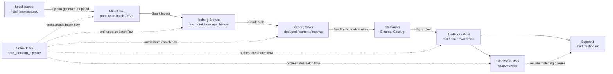

# StarRocks Dataflow POC - Bản báo cáo đã chỉnh sửa

## 1. Mục đích POC

POC này kiểm chứng một luồng BI local rút gọn cho bài toán hospitality booking:

```text
Local CSV -> MinIO raw -> Iceberg Bronze/Silver -> StarRocks -> dbt Gold marts -> Materialized Views -> Superset
```

Mục tiêu chính là chứng minh StarRocks có thể đóng vai trò warehouse/serving layer cho dashboard local MVP, thay cho vai trò Redshift/ClickHouse trong kiến trúc production-like ban đầu.

POC này không phải performance benchmark. POC cũng chưa triển khai realtime, Cube.dev, semantic layer hoặc Agentic AI.

Dataset sử dụng là **Hotel Booking Demand**. Dataset này phù hợp để demo các phân tích theo nhiều chiều như hotel, room, market segment, channel, country, customer type, cancellation và lead time. Dataset không có cost/expense thật, nên các metric revenue là estimated/simulated. Bất kỳ phần PNL/margin nào đều phải hiểu là simulated.

## 2. Kiến trúc hiện tại

Diagram được gom gọn theo storage layer để tránh dài dòng nhưng vẫn thể hiện rõ dữ liệu đang nằm ở đâu.



Điểm quan trọng: dbt không transform trực tiếp trong MinIO. Dữ liệu CSV được Spark ingest vào Iceberg trước. StarRocks đọc Iceberg qua External Catalog, sau đó dbt build các bảng Gold internal trong StarRocks.

## 3. Vai trò từng layer

| Layer | Storage/Engine | Vai trò |
| --- | --- | --- |
| Source | Local CSV | File gốc từ Kaggle, đặt tại `data/input/hotel_bookings.csv`. |
| Raw landing | MinIO | Lưu batch CSV immutable theo ingestion partition để audit/replay. |
| Bronze | Iceberg | Lưu append-only raw history đã enforce schema kỹ thuật và gắn metadata. |
| Silver | Iceberg | Lưu dữ liệu đã dedup, current state và booking-level metrics. |
| External access | StarRocks External Catalog | Cho StarRocks query Iceberg tables nhưng không sở hữu storage của Iceberg. |
| Gold | StarRocks internal tables | Lưu fact, dimension và mart tables để phục vụ BI/dashboard. |
| Optimization | StarRocks Materialized Views | Precompute aggregate và demo query rewrite. |
| BI | Superset | Dashboard chỉ query mart tables. |
| Orchestration | Airflow | Chạy batch flow tuần tự, low concurrency, manual trigger cho MVP. |

## 4. Raw MinIO storage

Raw CSV batch files được lưu trên MinIO theo ingestion partition:

```text
hotel_booking_demand/incremental_batches/
  etl_year=2026/
    etl_month=01/
      etl_day=01/
        raw_batch_sequence=001/
          batch_001_initial.csv
```

Ý nghĩa:

| Field | Ý nghĩa |
| --- | --- |
| `etl_year`, `etl_month`, `etl_day` | Ngày hệ thống ingest batch. Dùng để filter/replay batch theo ngày. |
| `raw_batch_sequence` | Thứ tự batch trong ngày, zero-padded để dễ sort. |
| `batch_id` | ID business batch, ví dụ `batch_001_initial`. |
| `batch_effective_at` | Thời điểm hiệu lực deterministic của batch. |

Không dùng `watermark_date` trong raw object path để tránh trùng nghĩa với `etl_*`. `watermark_date` chỉ còn là metadata/partition field trong Iceberg.

## 5. Synthetic incremental batches

Vì Kaggle dataset không có natural booking ID, batch generator tạo stable synthetic key:

```text
booking_key = source_dataset + ':' + original_source_row_number
```

`booking_key` được generate một lần trong batch generation script và persisted trong mọi batch. Spark không dùng `row_number()` runtime để tạo key, vì cách đó không ổn định khi rerun.

Các batch demo:

| Batch file | Mục đích |
| --- | --- |
| `batch_001_initial.csv` | Initial state của dữ liệu. |
| `batch_002_updates.csv` | Một số bản ghi thay đổi business columns, có duplicate có chủ ý. |
| `batch_003_duplicate_replay.csv` | Replay duplicate để test idempotency. |
| `batch_004_same_state.csv` | Cùng business state lặp lại, current state không bị inflate. |
| `batch_005_reverted_state.csv` | Một bản ghi đổi trạng thái rồi quay lại trạng thái cũ, current state phải lấy batch mới nhất. |

Production thực tế nên thay synthetic key bằng booking/reservation ID từ source system.

## 6. Spark ingestion và Iceberg Bronze

Spark đọc batch CSV từ MinIO raw, thực hiện technical pre-transform và ghi append-only vào Iceberg Bronze table:

```text
iceberg_catalog.hotel_booking_lakehouse.raw_hotel_bookings_history
```

Spark chịu trách nhiệm:

- schema enforcement cho source columns và metadata columns
- gắn metadata: `batch_id`, `batch_sequence`, `batch_effective_at`, `source_object_path`, `file_hash`, `ingested_at`, `row_ingestion_id`
- tạo normalized business columns phục vụ hashing
- tính `record_hash` từ business columns đã normalize
- ghi append-only vào Iceberg

`record_hash` chỉ tính từ business columns. Không đưa ingestion metadata vào hash như `batch_id`, `source_file_name`, `source_object_path`, `file_hash`, `ingested_at`, `row_ingestion_id`.

Lý do dùng Iceberg thay vì Parquet thuần:

- Iceberg có table metadata, snapshot và schema evolution rõ ràng.
- Query engine đọc qua catalog thay vì tự scan path thủ công.
- Có khả năng time travel/rollback ở mức table khi cần.
- Hỗ trợ partition evolution và manifest pruning tốt hơn khi dữ liệu lớn lên.
- StarRocks có thể đọc Iceberg qua External Catalog một cách có quản lý.

## 7. Iceberg Silver

Silver tables được Spark build trong Iceberg:

```text
iceberg_catalog.hotel_booking_silver.deduped_hotel_bookings
iceberg_catalog.hotel_booking_silver.current_hotel_bookings
iceberg_catalog.hotel_booking_silver.booking_metrics
```

Silver vẫn nằm ở Iceberg vì đây là tầng pre-transform/daily batch phù hợp với lakehouse storage:

- giảm việc lưu nhiều bảng trung gian vào SSD/local storage của StarRocks
- giữ lineage từ raw history sang cleaned/current/metrics
- phù hợp với batch rebuild/full refresh cho local MVP
- StarRocks vẫn query được qua External Catalog

Logic chính:

- `deduped_hotel_bookings`: bỏ duplicate/replay thật theo `booking_key + batch_id + record_hash`, giữ deterministic winner theo `row_ingestion_id`, `ingested_at`.
- `current_hotel_bookings`: chọn latest changed business state theo `booking_key`, `batch_sequence`, `batch_effective_at`, `row_ingestion_id`.
- `booking_metrics`: tính metric booking-level như `total_nights`, `total_guests`, `estimated_revenue`, `realized_revenue`, bucket lead time/stay length.

Không có model/table riêng cho change history ở dbt. Change-detection là kỹ thuật xử lý dữ liệu nằm trong Silver build để chọn current state và bảo vệ idempotency.

## 8. StarRocks External Catalog

External Catalog là thành phần của **StarRocks**, không phải tên gọi của Iceberg. Nó cho phép StarRocks query Iceberg tables qua Iceberg REST Catalog và MinIO.

Ví dụ kiểm tra trong StarRocks:

```sql
SHOW CATALOGS;
SHOW DATABASES FROM iceberg_catalog;
SHOW TABLES FROM iceberg_catalog.hotel_booking_lakehouse;
SHOW TABLES FROM iceberg_catalog.hotel_booking_silver;

SELECT batch_id, COUNT(*)
FROM iceberg_catalog.hotel_booking_lakehouse.raw_hotel_bookings_history
GROUP BY batch_id
ORDER BY batch_id;

SELECT COUNT(*)
FROM iceberg_catalog.hotel_booking_silver.current_hotel_bookings;
```

Iceberg external tables không có StarRocks table type. StarRocks table type chỉ áp dụng cho internal tables do dbt materialize trong `default_catalog.hotel_booking`.

## 9. dbt models

dbt đọc Iceberg Silver qua StarRocks External Catalog và materialize Gold tables trong StarRocks.

### dbt views trên Iceberg

Các model này là StarRocks views để tạo dbt lineage/test contract, không copy dữ liệu vào StarRocks:

```text
stg_iceberg_raw_hotel_bookings
int_hotel_bookings_deduped
int_current_hotel_bookings
int_booking_metrics
```

Lợi ích của việc giữ các view này:

- dbt có lineage rõ từ Bronze/Silver tới fact/marts
- dbt tests kiểm tra được key, null, duplicate và metric contract
- code SQL của dashboard layer có dependency rõ ràng qua `ref()`
- tránh copy staging/intermediate data vào StarRocks internal storage

Nếu muốn tối giản hơn, có thể bỏ một số view trung gian và để Gold model query thẳng Iceberg Silver. Tuy nhiên khi demo với mentor, giữ view giúp trình bày data contract và lineage rõ hơn.

### Gold internal tables

Các bảng Gold phục vụ Superset:

```text
fact_bookings
dim_date
dim_hotel
dim_room
dim_market_segment
dim_channel
dim_country
dim_customer_type
mart_daily_booking_revenue
mart_monthly_booking_revenue
mart_hotel_performance
mart_room_performance
mart_market_segment_performance
mart_channel_performance
mart_country_performance
mart_cancellation_analysis
mart_lead_time_analysis
mart_customer_type_performance
mart_simulated_pnl
```

`mart_simulated_pnl` là optional/simulated, không phải PNL thật.

## 10. StarRocks table type strategy

| Nhóm bảng | Storage | Table type hiện tại | Lý do |
| --- | --- | --- | --- |
| Iceberg Bronze/Silver | Iceberg external | Không có StarRocks table type | Iceberg quản lý table metadata/storage. |
| dbt staging/intermediate views | StarRocks view | Không có table type | View chỉ expose Iceberg cho dbt lineage/test. |
| `fact_bookings` | StarRocks internal | `PRIMARY KEY(booking_key)` | Fact current-state có stable key và được query nhiều bởi marts/MVs. |
| Dimension tables | StarRocks internal | `DUPLICATE KEY` cho MVP | Dim nhỏ, rebuild full-refresh, duplicate được kiểm soát bằng `DISTINCT` và dbt tests. |
| Mart tables | StarRocks internal | `DUPLICATE KEY` cho MVP | Mart là aggregate result, phục vụ dashboard read-heavy. |
| Materialized Views | StarRocks internal MV | MV riêng | Dùng để precompute aggregate và demo query rewrite. |

Mart lưu ở StarRocks internal vì đây là serving layer cho dashboard. Superset cần query nhanh, ổn định, ít phụ thuộc vào external lake scan. Staging/intermediate lưu ở Iceberg vì phù hợp với daily batch, audit, rebuild và giảm storage pressure cho StarRocks.

## 11. Airflow DAG

DAG chính:

```text
hotel_booking_pipeline
```

Luồng task group:

```text
precheck
  -> check_csv_exists
  -> profile_dataset

ingestion
  -> generate_synthetic_batches
  -> upload_batches_to_minio
  -> wait_for_minio
  -> wait_for_iceberg_rest
  -> run_spark_iceberg_ingestion
  -> run_spark_iceberg_silver_models
  -> wait_for_starrocks
  -> create_starrocks_database
  -> create_iceberg_external_catalog
  -> validate_iceberg_history_row_counts
  -> validate_iceberg_silver_tables

transformation
  -> dbt_debug
  -> dbt_run
  -> dbt_test

optimization
  -> apply_starrocks_materialized_views
  -> validate_materialized_view_rewrite

validation
  -> log_validation_counts
```

Ý nghĩa dbt steps:

- `dbt_debug`: kiểm tra profile, connection tới StarRocks, target schema.
- `dbt_run`: build view/table models theo dependency graph.
- `dbt_test`: chạy data tests, fail DAG nếu data contract không đạt.

DAG được thiết kế manual trigger, sequential, low concurrency để phù hợp máy local.

## 12. Validation hiện tại

Validation được chia thành 3 nhóm:

| Nhóm | Cách chạy | Mục đích |
| --- | --- | --- |
| Pipeline validation | Tự động trong Airflow DAG | Fail fast nếu data/service/model không đạt điều kiện tối thiểu. |
| Data contract validation | Tự động trong `dbt test` | Kiểm tra key, null, duplicate, metric và serving tables. |
| Demo readiness validation | Chạy thủ công hoặc trước buổi demo | Tổng hợp các check dễ trình bày với mentor. |

### 12.1 Pipeline validation trong Airflow

Các check này chạy tự động khi trigger DAG `hotel_booking_pipeline`.

| Task | Tự động fail DAG? | Kiểm tra |
| --- | --- | --- |
| `check_csv_exists` | Có | File `data/input/hotel_bookings.csv` tồn tại và không rỗng. |
| `profile_dataset` | Có nếu script lỗi | Chạy `scripts/profile_dataset.py`, ghi `docs/data_profile_summary.md`. File này chỉ profile original CSV, không profile batch/Iceberg. |
| `generate_synthetic_batches` | Có | Tạo deterministic incremental batch files từ original CSV. |
| `upload_batches_to_minio` | Có | Upload batch CSV vào MinIO raw bucket theo path `etl_year/etl_month/etl_day/raw_batch_sequence`. |
| `wait_for_minio` | Có | MinIO reachable trong Docker network. |
| `wait_for_iceberg_rest` | Có | Iceberg REST Catalog reachable. |
| `run_spark_iceberg_ingestion` | Có | Spark đọc batch CSV từ MinIO và append vào Bronze Iceberg. Batch đã ingest sẽ được skip nếu không dùng `--force`. |
| `wait_for_starrocks` | Có | StarRocks port `9030` reachable và `SELECT 1` chạy được. |
| `create_iceberg_external_catalog` | Có | StarRocks có External Catalog trỏ tới Iceberg REST + MinIO. |
| `validate_iceberg_history_row_counts` | Có | Row count của batch CSV local khớp Bronze Iceberg theo `batch_id`. |
| `run_spark_iceberg_silver_models` | Có | Build Silver Iceberg tables: deduped, current, metrics. |
| `validate_iceberg_silver_tables` | Có | Silver Iceberg tables visible qua StarRocks và có rows. |
| `dbt_debug` | Có | dbt profile, connection và target schema hợp lệ. |
| `dbt_run` | Có | Build dbt views/tables trong đúng dependency graph. |
| `dbt_test` | Có | Chạy toàn bộ dbt tests. |
| `apply_starrocks_materialized_views` | Có | Create/refresh/validate Materialized Views. |
| `validate_materialized_view_rewrite` | Có | `EXPLAIN` query aggregate phải rewrite sang `mv_daily_booking_revenue`. |
| `log_validation_counts` | Có | Serving tables non-empty, current-state checks và fixture checks đạt. |

### 12.2 Data contract validation trong dbt

Các validation này nằm trong `dbt/hotel_booking/models/schema.yml` và `dbt/hotel_booking/tests/`.

| Nhóm test | Nội dung |
| --- | --- |
| Source contract | `booking_key`, `batch_id`, `batch_sequence`, `batch_effective_at`, `record_hash`, `etl_*`, `watermark_date`, `raw_batch_sequence` không null. |
| Dedup contract | Mỗi `booking_key + batch_id` chỉ có tối đa một `record_hash`. Nếu cùng một booking trong cùng batch có nhiều business state khác nhau thì test fail. |
| Current-state contract | `int_current_hotel_bookings` có đúng một row cho mỗi `booking_key`. |
| Fixture contract | `batch_004_same_state` không làm đổi current state sai; `batch_005_reverted_state` phải trở thành latest current state cho fixture tương ứng. |
| Metric contract | `total_nights`, `adr`, `estimated_revenue`, `realized_revenue` không âm. |
| Fact contract | `fact_bookings.booking_key` not null + unique, `is_cancelled` chỉ nhận `0/1`, fact table không rỗng. |
| Dimension contract | Dim tables không rỗng và các dimension key chính không null. |
| Mart contract | Mart tables không rỗng và các dimension/time grain chính không null. |
| Simulated PNL contract | `mart_simulated_pnl` không rỗng, nhưng cost/margin vẫn là simulated, không phải finance data thật. |

Chạy thủ công nếu cần debug ngoài Airflow:

```bash
docker compose exec airflow-webserver \
  dbt test \
  --project-dir /opt/airflow/dbt/hotel_booking \
  --profiles-dir /opt/airflow/dbt/hotel_booking \
  --no-partial-parse \
  --threads 1
```

### 12.3 StarRocks và Iceberg SQL validation

Các câu SQL này dùng để demo hoặc kiểm tra nhanh sau khi DAG success.

```sql
SHOW CATALOGS;
SHOW DATABASES FROM iceberg_catalog;
SHOW TABLES FROM iceberg_catalog.hotel_booking_lakehouse;
SHOW TABLES FROM iceberg_catalog.hotel_booking_silver;
SHOW TABLES FROM hotel_booking;

SELECT batch_id, COUNT(*) AS row_count
FROM iceberg_catalog.hotel_booking_lakehouse.raw_hotel_bookings_history
GROUP BY batch_id
ORDER BY batch_id;

SELECT COUNT(*) AS current_rows
FROM iceberg_catalog.hotel_booking_silver.current_hotel_bookings;

SELECT COUNT(*) AS fact_rows
FROM hotel_booking.fact_bookings;

SELECT COUNT(*) AS daily_mart_rows
FROM hotel_booking.mart_daily_booking_revenue;
```

Kiểm tra current-state và duplicate:

```sql
SELECT booking_key, batch_id, COUNT(DISTINCT record_hash) AS distinct_record_hashes
FROM hotel_booking.stg_iceberg_raw_hotel_bookings
GROUP BY booking_key, batch_id
HAVING COUNT(DISTINCT record_hash) > 1;

SELECT
    (SELECT COUNT(*) FROM hotel_booking.int_current_hotel_bookings) AS current_rows,
    (SELECT COUNT(DISTINCT booking_key) FROM hotel_booking.stg_iceberg_raw_hotel_bookings) AS distinct_booking_keys;
```

### 12.4 Materialized View validation

MV validation có hai phần:

- `scripts/apply_starrocks_materialized_views.py` chạy SQL create/refresh/validate.
- Airflow task `validate_materialized_view_rewrite` kiểm tra query rewrite bằng `EXPLAIN`.

SQL demo:

```sql
SHOW MATERIALIZED VIEWS FROM hotel_booking;

EXPLAIN
SELECT
    arrival_date,
    COUNT(*) AS total_bookings,
    SUM(is_cancelled) AS cancelled_bookings,
    COUNT(*) - SUM(is_cancelled) AS successful_bookings,
    SUM(is_cancelled) / NULLIF(COUNT(*), 0) AS cancellation_rate,
    SUM(total_nights) AS total_nights,
    SUM(estimated_revenue) AS estimated_revenue,
    SUM(realized_revenue) AS realized_revenue,
    AVG(adr) AS average_adr
FROM hotel_booking.fact_bookings
WHERE arrival_date IS NOT NULL
GROUP BY arrival_date;
```

Kết quả đạt khi `EXPLAIN` có marker như `mv_daily_booking_revenue` hoặc `MaterializedView: true`.

### 12.5 Demo readiness validation

Trước khi demo, có thể chạy script tổng hợp:

```bash
docker compose exec airflow-webserver \
  python /opt/airflow/scripts/demo_readiness.py
```

Script này kiểm tra:

- original CSV và generated batch files
- MinIO raw batch objects
- StarRocks database và External Catalog
- Bronze/Silver Iceberg tables visible qua StarRocks
- dbt views, fact/dim/mart tables tồn tại và có rows
- current-state validations
- Materialized Views tồn tại, active và rewrite được query phù hợp

### 12.6 Validation còn thủ công

Các phần này hiện chưa tự động fail DAG:

- Mở Superset UI và xác nhận dashboard render được.
- Xác nhận Superset datasets/charts chỉ dùng mart tables, không dùng raw/staging/intermediate tables.
- Nhìn dashboard để kiểm tra layout, filter và chart title có dễ hiểu không.
- Đọc `docs/data_profile_summary.md` để giải thích missing values, ADR outliers và zero-night bookings.

### 12.7 Validation có thể bổ sung nếu muốn chặt hơn

Các check dưới đây chưa bắt buộc cho MVP nhưng nên cân nhắc nếu muốn report mạnh hơn:

- Automated check Superset dashboard metadata để đảm bảo chart datasource là mart tables only.
- Automated check StarRocks table type: `fact_bookings` là `PRIMARY KEY`, dim/mart là `DUPLICATE KEY`.
- Mart consistency checks: tổng bookings/revenue từ daily/monthly/hotel/channel/country marts khớp `fact_bookings`.
- Automated rerun idempotency test: chạy DAG lần 2 và assert Bronze/Silver/Gold counts không bị inflate.
- Hash rule audit: verify `record_hash` không include ingestion metadata.
- MinIO legacy object check: fail nếu còn raw object từ format cũ ngoài path `etl_year/etl_month/etl_day/raw_batch_sequence`.

## 13. Materialized Views

Materialized Views được đưa vào luồng chính sau `dbt_test`:

```text
starrocks/materialized_views/01_create_materialized_views.sql
starrocks/materialized_views/02_refresh_materialized_views.sql
starrocks/materialized_views/03_validate_materialized_views.sql
```

Mục đích:

- demo StarRocks serving optimization
- precompute aggregate từ `hotel_booking.fact_bookings`
- validate query rewrite bằng `EXPLAIN`

Ví dụ demo:

```sql
EXPLAIN
SELECT
    arrival_date,
    COUNT(*) AS total_bookings,
    SUM(is_cancelled) AS cancelled_bookings,
    COUNT(*) - SUM(is_cancelled) AS successful_bookings,
    SUM(is_cancelled) / NULLIF(COUNT(*), 0) AS cancellation_rate,
    SUM(total_nights) AS total_nights,
    SUM(estimated_revenue) AS estimated_revenue,
    SUM(realized_revenue) AS realized_revenue,
    AVG(adr) AS average_adr
FROM hotel_booking.fact_bookings
WHERE arrival_date IS NOT NULL
GROUP BY arrival_date;
```

Khi rewrite thành công, `EXPLAIN` có thể hiện `mv_daily_booking_revenue` hoặc marker `MaterializedView: true`.

## 14. Superset dashboard

Superset kết nối StarRocks bằng URI:

```text
starrocks://root:@starrocks:9030/default_catalog.hotel_booking
```

Dashboard chỉ dùng mart tables, không dùng raw/staging/intermediate tables.

Các nhóm chart:

- Overview KPIs
- Time Trends
- Hotel / Room Performance
- Segment / Channel Analysis
- Country / Demand Analysis
- Cancellation / Lead Time Analysis

Superset dashboard có thể bootstrap bằng script:

```bash
docker compose exec airflow-webserver \
  python /opt/airflow/scripts/bootstrap_superset_dashboard.py
```

Sau khi rerun Airflow/dbt, dashboard chỉ cần refresh chart/dataset trong Superset. Nếu schema mart không đổi thì không cần tạo lại dashboard.

## 15. Demo flow đề xuất

1. Mở kiến trúc và giải thích storage:
   - MinIO raw là immutable CSV landing.
   - Iceberg Bronze/Silver là lakehouse table storage.
   - StarRocks Gold là serving layer cho BI.

2. Show MinIO:
   - raw batch files theo `etl_year/etl_month/etl_day/raw_batch_sequence`.

3. Show Iceberg qua StarRocks:
   ```sql
   SHOW DATABASES FROM iceberg_catalog;
   SHOW TABLES FROM iceberg_catalog.hotel_booking_lakehouse;
   SHOW TABLES FROM iceberg_catalog.hotel_booking_silver;
   ```

4. Trigger Airflow DAG:
   - show task groups: precheck, ingestion, transformation, optimization, validation.

5. Show dbt:
   - `dbt docs generate` hoặc dbt model tree nếu cần.
   - explain views over Iceberg và Gold mart tables.

6. Show StarRocks tables:
   ```sql
   SHOW TABLES FROM hotel_booking;
   SELECT COUNT(*) FROM hotel_booking.fact_bookings;
   SELECT COUNT(*) FROM hotel_booking.mart_daily_booking_revenue;
   ```

7. Show MV rewrite:
   - chạy `EXPLAIN` query aggregate.

8. Show Superset:
   - dashboard query mart tables only.

## 16. Những điểm cần nói rõ với mentor

- POC hiện là batch-only.
- Synthetic `booking_key` chỉ dùng cho MVP vì dataset Kaggle không có booking ID thật.
- Revenue là estimated revenue: `adr * total_nights`.
- Realized revenue chỉ tính cho non-cancelled bookings.
- Simulated PNL là optional, không phải profit/cost thật.
- Iceberg phù hợp cho raw/silver historical và rebuild daily.
- StarRocks phù hợp cho Gold serving/mart/dashboard.
- Materialized View là demo optimization, không thay thế mart table trong MVP.

## 17. Trạng thái cần validate trước demo

Chạy full DAG lại sau khi reset dữ liệu hoặc đổi schema:

```bash
docker compose up -d
```

Trong Airflow UI:

```text
Trigger DAG: hotel_booking_pipeline
```

Sau khi DAG success:

```sql
SHOW DATABASES FROM iceberg_catalog;
SHOW TABLES FROM iceberg_catalog.hotel_booking_lakehouse;
SHOW TABLES FROM iceberg_catalog.hotel_booking_silver;
SHOW TABLES FROM hotel_booking;

SELECT COUNT(*) FROM hotel_booking.fact_bookings;
SELECT COUNT(*) FROM hotel_booking.mart_daily_booking_revenue;
SELECT COUNT(*) FROM hotel_booking.mart_monthly_booking_revenue;
SELECT COUNT(*) FROM hotel_booking.mart_hotel_performance;
```

Nếu Superset chart lỗi sau khi đổi schema:

1. Refresh dataset metadata trong Superset.
2. Re-run bootstrap dashboard script nếu cần.
3. Không dùng raw/staging/intermediate tables làm dataset dashboard.
